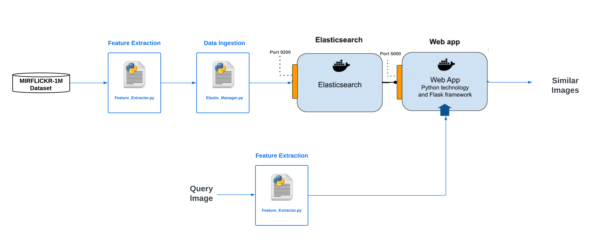

# **Elastic Search Image VGG16 Similarity**


### **Project Overview**
This project integrates **ElasticSearch** with the **k-NN plugin** for image similarity search. By using the **VGG16 model** to extract features from images, it enables efficient retrieval based on feature similarity. Additionally, fuzzy search is supported through the addition of tags and the use of dimensionality reduction techniques.

---
### **Table of Contents**
- [Project Overview](#project-overview)
- [Demo](#Demo)
- [Architecture Diagram](#architecture-diagram)
- [File Architecture](#file-architecture)

- [Docker Compose Setup](#docker-compose-setup)
  - [Clone the Repository](#clone-the-repository)
  - [Build and Start the Services](#build-and-start-the-services)
  - [Stopping the Services](#stopping-the-services)
  - [Configuration and Customization](#configuration-and-customization)
- [First Steps](#first-steps)
  - [Feature Extraction from Images](#feature-extraction-from-images)
  - [Index Mapping & Data Loading](#index-mapping--data-loading)
- [Functionalities](#functionalities)
  - [Performing k-NN Search](#performing-knn-search)
  - [Fuzzy Search and Dimensionality Reduction](#fuzzy-search-and-dimensionality-reduction)
- [References](#references)

---

### **Project Overview**
This project integrates **ElasticSearch** with the **k-NN plugin** for image similarity search. By using the **VGG16 model** to extract features from images, it enables efficient retrieval based on feature similarity. Additionally, fuzzy search is supported through the addition of tags and the use of dimensionality reduction techniques.

---
### **Demo**
[](https://github.com/yusufM03/Image-Search-Engine/blob/main/assets/Demo.mp4)

---

### **Architecture Diagram**


---

### **File Architecture**

Here is the directory structure of the project:

```plaintext
Image-Search-Engine/
│
├── flask-app/
│   ├── Dockerfile.flask               # Dockerfile for Flask app configuration
│   ├── Feature_ExtractorManager.py    # Script for feature extraction from images using VGG16
│   ├── ElasticManager.py             # Script for loading image features into ElasticSearch
│   ├── requirements.txt             # List of dependencies for Flask app
│   └── app.py                          # Flask app
│       
│
├── elasticsearch/
│   ├── Dockerfile.elasticsearch      # Dockerfile for ElasticSearch with k-NN plugin
│                        
└── docker-compose.yml                # Docker Compose file to orchestrate containers
```

- **flask-app/**: Contains the Flask app code for handling image feature extraction and interaction with ElasticSearch.
- **elasticsearch/**: Contains the configuration for ElasticSearch, including the k-NN plugin setup.
- **docker-compose.yml**: Defines and manages the services for both the Flask app and ElasticSearch.

---

### **Tools Used**

- **Flask**: A lightweight Python web framework used to create the backend for this project. It handles image processing, feature extraction, and managing communication with the ElasticSearch service.
- **JavaScript, CSS, HTML**: Used for building the front-end interface. JavaScript handles the dynamic interaction with the backend, while HTML and CSS are used for structuring and styling the web page.
- **ElasticSearch**: A distributed search engine used for storing image feature data and performing k-NN (k-Nearest Neighbor) searches. ElasticSearch is enhanced with the k-NN plugin to support similarity searches based on the VGG16 image features.
---

### **Docker Compose Setup**

You can easily set up both **ElasticSearch** and the **Flask app** using Docker Compose. Follow the steps below to get started.

#### **1. Clone the Repository:**
```bash
git clone https://github.com/yusufM03/Image-Search-Engine.git
cd Image-Search-Engine
```

#### **2. Build and Start the Services:**
Docker Compose will automatically build the necessary images for both **ElasticSearch** and the **Flask app** from their respective Dockerfiles.

Run the following command to build and start the services:

```bash
docker-compose up --build
```

This will start both the **ElasticSearch container** (with the k-NN plugin) and the **Flask app container**. ElasticSearch will be accessible on `http://localhost:9200`, and the Flask app will run on `http://localhost:5000`.

#### **3. Stopping the Services:**
To stop the services, use the following command:

```bash
docker-compose down
```

#### **4. Configuration and Customization:**
- **ElasticSearch Dockerfile:** Custom settings for ElasticSearch and the k-NN plugin are specified in `Dockerfile.elasticsearch`.
- **Flask App Dockerfile:** The Flask app, including its dependencies, is configured in `Dockerfile.flask`.

---

### **First Steps**

#### **1. Feature Extraction from Images**
- Use the **VGG16 model** to extract image features, which represent high-level patterns and semantics that allow for similarity-based retrieval.

Open a new terminal and run:
```bash
cd flask-app
python Feature_ExtractorManager.py
```

#### **2. Index Mapping & Data Loading**
- Define the index mapping to store image feature vectors.
- Load the image features extracted from VGG16 into ElasticSearch by running:
```bash
cd flask-app
python ElasticManager.py
```

---

### **Functionalities**

#### **1. Performing k-NN Search**

- **Approximate k-NN:** Use **ElasticSearch's k-NN plugin** to efficiently perform approximate k-NN (k-Nearest Neighbors) search for retrieving similar images based on extracted features.

---

#### **2. Fuzzy Search and Dimensionality Reduction**

- **Dimensionality Reduction using PCA:** Reduce the dimensionality of feature vectors using **Principal Component Analysis (PCA)** for improved search performance.
- **Adding Tags for Fuzzy Search:** Add **tags** to image data to support fuzzy search, narrowing down search results based on specific filters.

---

### **References**
- [ElasticSearch Docker Guide](https://www.elastic.co/guide/en/elasticsearch/reference/index.html)
- [Machine Learning NLP Text Embedding Vector Search Example](https://www.elastic.co/blog/using-elasticsearch-for-vector-search)
- [k-NN Search Documentation](https://www.elastic.co/guide/en/elasticsearch/plugins/current/knn.html)


